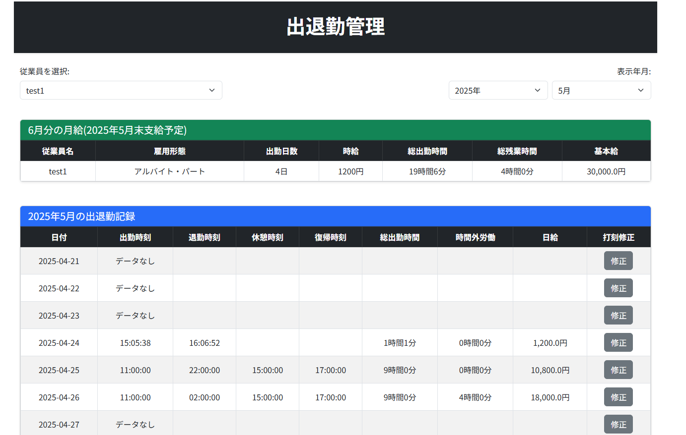

# 👨‍💼 勤怠管理Webアプリ (Attendance System)

## 🌟 プロジェクト概要

本アプリは、自営業にて実際に運用することを想定して開発した、勤怠管理用のWebアプリケーションです。  
従業員がスマートフォンやタブレットから出勤・退勤・休憩・復帰をワンタップで打刻できるシステムで、管理者は出退勤の履歴確認・打刻修正・月次給与の自動計算までを一括で管理できます。

「紙のタイムカードと手計算から解放されること」を目的に開発され、現在はRender上でデプロイされ、テスト運用中です。

---

## 🔧 使用技術

- **言語・フレームワーク**  
  Python (Flask), JavaScript, HTML5, CSS3 (Bootstrap)

- **データベース / ORM**  
  PostgreSQL, SQLAlchemy, Flask-Migrate

- **デプロイ**
  Render（本番環境）

- **その他**  
  Jinja2（テンプレートエンジン）

---

## ✨ 主な機能

### 【一般従業員向け機能】
- 出勤 / 退勤 / 休憩 / 復帰のワンタッチ打刻
- 状態に応じたボタン制御（誤操作防止）

---

### 【管理者専用機能】
- 打刻データの訂正機能（出勤忘れや誤打刻の修正）
- 出退勤履歴の一覧表示（従業員別・日別）
- 月ごとの出勤日数・労働時間・給与合計の自動集計
- アルバイト（時給制）と正社員（固定給）に対応

---

## 📷 スクリーンショット

従業員用の出退勤画面：  

管理者用の履歴・集計画面：  

---

## ディレクトリ構成

flask_pomme/
├── app.py
├── time_project/
│   ├── __init__.py
│   ├── models.py
│   └── main/views.py
├── static/
│   └── indexscript.js
├── templates/
│   └── index.html
├── img/
│   ├── screenshot1.png
│   └── screenshot2.png
└── requirements.txt

---

## 💡 作成者

KisukeWatanabe
